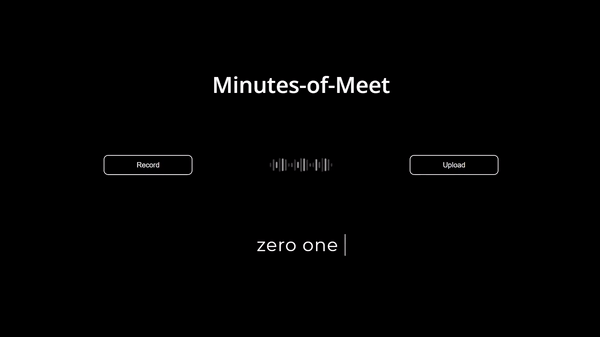

# minutesOfMeet

> Automatic Minutes of Meet Generator

----

### Table of Contents

- [Description](#descritption)
- [Demo](#demo)

----

## Description

This is an automatic minutes of meet generator. It consists of two parts :-

- Speech Recognition - built using the [DeepSpeech](https://github.com/mozilla/DeepSpeech) speech-to-text engine.
- Text Summarization - built using the [BART Large](https://huggingface.co/facebook/bart-large) model, pre-trained on CNN and fine-tuned on SAMSum.

The web app was built using Python, Flask and Vanilla JS.

#### Features

- Audio input can be provided as an audio file as well as by using the live recording feature.
- Summary generated is abstractive rather than extractive and is hence suitable for  meeting summarization.
- Along with the summary, a transcript is also generated.

[Back To The Top](#minutesOfMeet)

---

## Demo

Click [here](https://drive.google.com/file/d/1bPVsW92wIAXIvjacuemJ2CO6xfkaAk4k/view?usp=sharing) to check out the demo!

 
